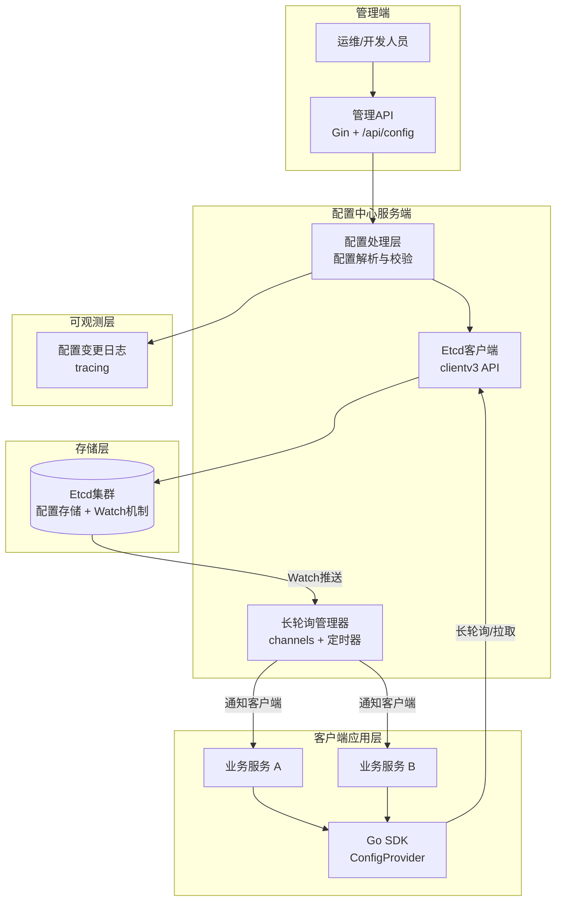

## 第一部分：选题填表

| **类别** | **编号** | **题目** | **限报** | **要求** | **需求概述** | **担任角色** | **建议方案** | **建议语言** | **成果形式** |
|:---:|:---:|:---|:---:|:---:|:---|:---|:---|:---:|:---|
| **Rust和Go高并发架构** | 5 | **Go轻量级分布式配置中心** | 3 | | 基于Etcd开发一个轻量级配置中心，实现多环境（dev/prod）配置管理、动态热加载和版本回滚。支持HTTP API进行配置发布，客户端长轮询监听变更，服务端配置变更实时推送，无需重启应用即可生效。配套提供Go客户端SDK示例，支持配置项分组管理和JSON/YAML格式解析。| 后端 | **核心存储**：Etcd 3.x（分布式KV存储，支持Watch机制）+ clientv3 API<br>**后端服务**：Go + Gin（管理API）+ Etcd Watch（变更监听）<br>**SDK设计**：ConfigProvider接口抽象 + 本地缓存 + 长轮询/WebSocket推送<br>**版本控制**：Etcd MVCC多版本支持，记录配置变更历史<br>**部署**：Docker Compose（Etcd集群 + 配置中心实例） | Go | 系统、开发报告 |


## 第二部分：完整设计方案与开发思路（2周版）

### 一、选题背景与价值定位

在2026年的微服务架构中，配置管理已经从本地配置文件逐渐转向集中式配置中心。相比通过文件或环境变量下发配置的传统方式，现代配置中心要求“配置动态生效、应用无需重启”这一标准能力——这正是Etcd的Watch机制发挥核心价值的地方。Go语言因其轻量高效，天然适合构建云原生的配置中心，而腾讯云、阿里云等各大厂商的微服务体系中，配置中心已是最基础的组件之一。

本项目的核心价值在于：让学生在2周内从零构建一个轻量级但功能完整的配置中心，掌握Etcd集成、长轮询推送、SDK设计与热加载机制等企业级技能。对标nacos等商业产品的轻量级自实现，直接在本地体验配置实时推送到服务的完整链路。


### 二、系统架构设计



### 三、核心功能模块设计（2周可完成）

#### 模块1：配置存储设计（基于Etcd）

利用Etcd的层级化Key-Value存储能力，设计配置路径规范：`/config/{app}/{env}/{version}/{group}/{key}`。示例如下：

```
/config/order-service/prod/v1/database/host
/config/order-service/prod/v1/database/port
/config/order-service/prod/v1/redis/addr
```

借助Etcd的**MVCC（多版本并发控制）** 特性实现配置版本管理：每次配置变更自动生成新revision，通过记录版本号支持快速回滚到任意历史版本。

#### 模块2：管理API（Gin实现）

提供以下核心管理接口：

| 端点 | 方法 | 功能 |
|:---|:---|:---|
| `/api/config` | POST | 发布配置（JSON/YAML格式），支持版本号和变更说明 |
| `/api/config` | GET | 查询配置，支持按应用、环境、分组过滤 |
| `/api/config` | DELETE | 删除配置 |
| `/api/config/rollback` | POST | 回滚到指定版本（指定app+env+版本号） |
| `/api/config/diff` | GET | 对比两个版本的配置差异 |
| `/api/watch` | GET | 客户端长轮询监听配置变更（携带last_revision） |

每个接口统一进行格式校验、权限校验和结构化日志记录。

#### 模块3：长轮询与配置变更推送

客户端通过携带`last_revision`参数发起长轮询请求，服务端实现逻辑为：

1. 比较客户端`last_revision`与Etcd当前配置revision
2. 若大于，立即返回最新配置
3. 若相等，将客户端请求注册到`waitingChannels`映射中，挂起等待（最长60秒）
4. 当配置发生变更时，Etcd Watch触发回调，批量唤醒等待的客户端
5. 超出等待时间仍无变更则返回304 Not Modified

该机制的并发复杂度在于管理大量挂起的HTTP连接，需利用Go的goroutine轻量级特性，每个等待请求单独阻塞于一个channel。

#### 模块4：客户端SDK设计

提供开箱即用的Go客户端SDK，实现以下功能：

```go
type ConfigProvider interface {
    Get(key string) (string, error)           // 获取配置值
    GetJSON(key string, target interface{}) error
    Watch(ctx context.Context, onChange func(event ConfigChangeEvent)) error
    Close() error
}
```

**SDK内建能力**：
- **本地缓存**：首次拉取后缓存到内存，后续访问命中缓存后直接返回，减少Etcd查询压力
- **后台热加载**：启动独立goroutine进行长轮询监听，配置变更时自动更新缓存并触发回调
- **降级策略**：Etcd不可用时使用缓存配置或本地备份文件，保障业务服务不受配置中心故障影响

#### 模块5：版本管理与回滚

利用Etcd的MVCC特性实现版本管理：

- 每次配置发布在Etcd中写入新的key，同时增加`_meta`元数据key记录（版本号、发布时间、发布人、变更说明、revision号）
- 版本回滚操作：客户端通过管理API发起请求，指定`app`、`env`和目标`version`。服务端从Etcd读取该版本的配置内容，重新发布为新版本（分配新版本号），原有版本记录不删除以保留审计链路
- 提供`/api/config/diff`接口，支持两个版本之间的配置对比，便于运维人员确认回滚影响范围

#### 模块6：配置热加载与业务集成

业务服务集成SDK后实现配置热加载的完整流程：

1. **启动阶段**：SDK从Etcd拉取完整配置，初始化本地缓存
2. **监听阶段**：SDK启动Watch goroutine，持续监听`/config/{app}/{env}/`前缀下的所有变更
3. **变更响应**：SDK收到变更事件后更新本地缓存，并通过回调通知业务模块
4. **业务适配**：业务模块注册回调函数，在配置变更时动态更新内部状态（如数据库连接池参数、限流阈值等），实现热加载

### 四、开发路线图（2周/10个工作日）

| 阶段 | 天数 | 任务 | 输出物 |
|:---|:---|:---|:---|
| **第1-2天** | 2 | 项目初始化；Docker部署Etcd集群；Gin搭建管理API基础框架 | Etcd集群可访问，基础HTTP服务 |
| **第3-4天** | 2 | 实现Etcd CRUD操作（clientv3集成）；配置路径设计与序列化（JSON/YAML）| 配置发布和查询功能完成 |
| **第5-6天** | 2 | 实现长轮询机制（goroutine + channel）；Etcd Watch监听配置变更 | 配置变更实时推送功能完成 |
| **第7-8天** | 2 | 实现版本管理与回滚功能；开发Go客户端SDK（Provider接口+缓存+Watch） | 版本控制和SDK可用 |
| **第9-10天**| 2 | 编写单元测试；Docker Compose一键部署；压测（并发监听100+客户端）；撰写项目报告 | 完整交付+部署文档 |

### 五、技术挑战与简化策略

| 挑战 | 简化策略 |
|:---|:---|
| Etcd集群部署复杂度 | 使用Docker Compose启动单节点Etcd（学习模式），支持扩展为3节点生产模式 |
| 长轮询连接管理 | 使用`sync.Map`存储`requestID -> chan`，利用goroutine轻量特性承载大量等待连接 |
| 配置格式校验 | 仅支持JSON/YAML两种格式，使用标准库校验格式合法性 |
| SDK跨语言支持 | 2周内仅实现Go SDK，提供清晰的设计模式供学生后续扩展到其他语言 |

### 六、验证与压测方案

**功能验证**：
- 通过管理API发布配置，验证客户端SDK能在5秒内收到变更通知并更新本地缓存
- 回滚测试：发布v1→v2→回滚v1，验证客户端配置正确恢复
- 降级测试：停止Etcd容器，验证SDK能继续使用缓存配置并记录错误日志

**性能测试**：
- **监听能力验证**：模拟100个客户端同时启动长轮询监听，测试服务端连接管理能力和资源消耗
- **推送延迟测量**：发布新配置后，统计100个客户端中首个收到变更通知的时间（目标p99 < 3秒）
- **管理API吞吐量**：使用wrk对发布配置接口进行压测（目标QPS ≥ 500），观察服务端响应时间

### 七、拓展方向（两周后可选的完善）

- **配置加密**：集成Vault或AES加密，敏感配置落盘加密存储
- **配置审计**：记录所有配置变更的完整操作日志（时间、操作人、变更内容、回滚记录）
- **Web UI控制台**：使用React/Leptos构建可视化配置管理界面，支持拖拽式配置编辑和版本树展示
- **多数据中心同步**：支持跨Etcd集群的配置同步和灾备切换

### 八、成果形式

- 源代码仓库（GitHub），包含完整的README.md（启动说明、API文档、SDK使用示例）
- Docker Compose编排文件，一键启动Etcd+配置中心服务端
- Go客户端SDK使用示例（演示配置热加载）
- 项目设计报告（需求分析、架构设计、核心模块说明、测试验证结果）